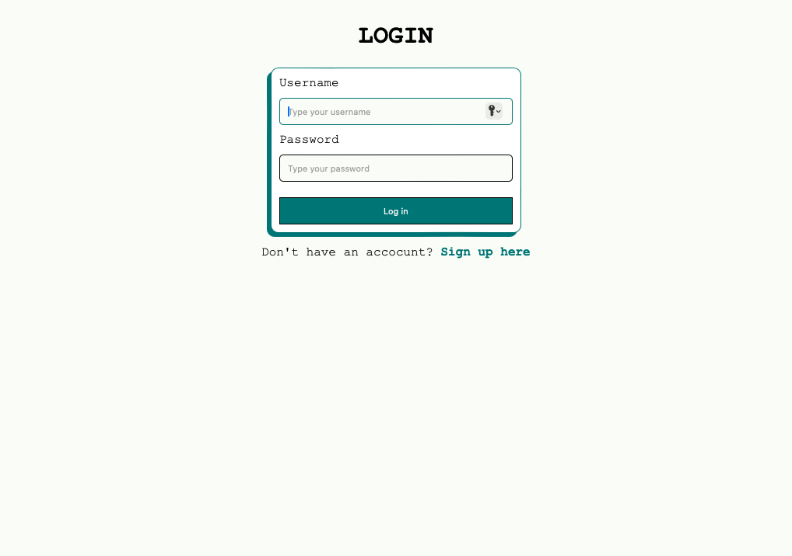
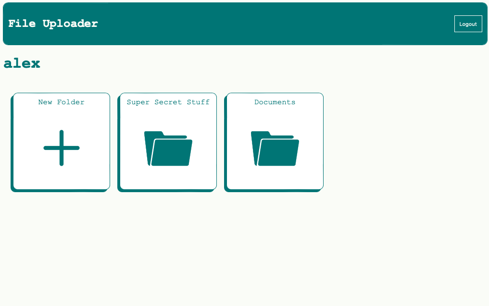
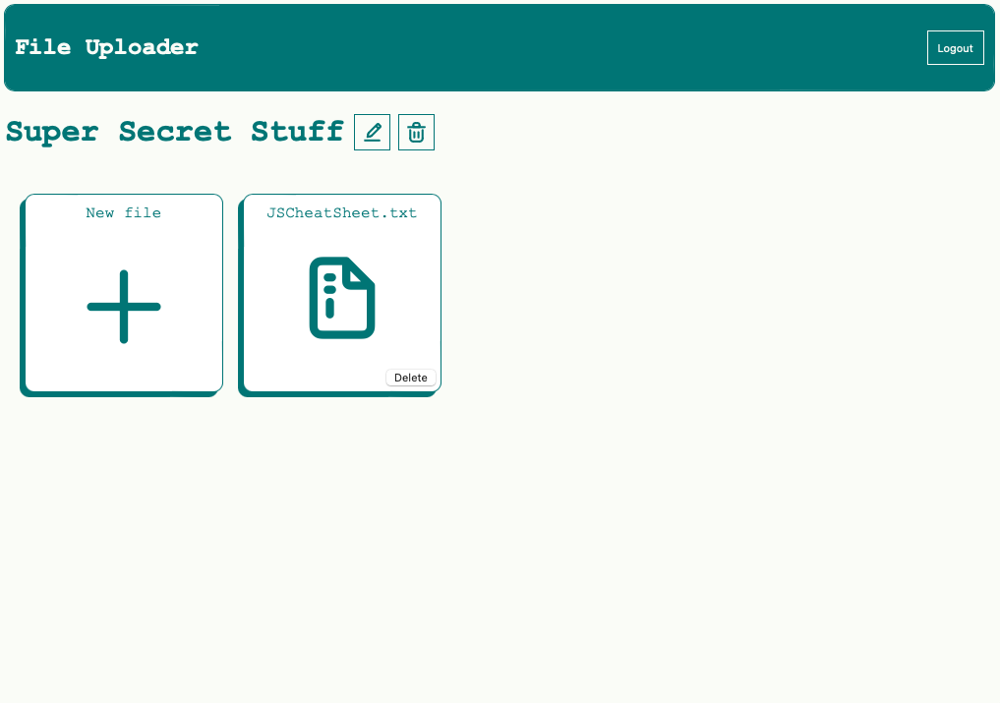

# File-Uploader

---

## About this project

A project set by the Odin Project to build a cloud storage site to flex SQL and an ORM capabilites as-well as display capability to work with 3rd party API's (Cloudinary) built within an express app, using EJS as the view engine. 

---

## Technologies

JS

CSS

EJS

NodeJS

Express

PSQL

Prisma

---
## Live Link

https://file-uploader-999.adaptable.app

---

## Screenshots

### Picture 1

### Picture 2

### Picture 3

